<!DOCTYPE html>
<html lang="ru-ru">

    <head>
        <meta http-equiv="Content-Type" content="text/html; charset=utf-8">
        <meta name="viewport" content="width=device-width, initial-scale=1.0, shrink-to-fit=no">
        <meta http-equiv="X-UA-Compatible" content="ie=edge">
        <link rel="stylesheet" href="assets/css/style.css" type="text/css">
        <link rel="apple-touch-icon" type="image/png" sizes="146x146" href="assets/img/icons/favicon.png">
        <link rel="icon" type="image/png" sizes="146x146" href="assets/img/icons/favicon.png">
        <link rel="shortcut icon" href="assets/img/icons/favicon.png">
        <title>Автономная система канализации BiNeo</title>
    </head>

    <body>
    

    <section id="first">
        

        

            <h1>Композитная разборная самонесущая автономная канализация</h1>
        

    </section>
    <section id="second">
        

            
            

                

                    

                        <ul id="slidewrapper">
                            <li class="slide">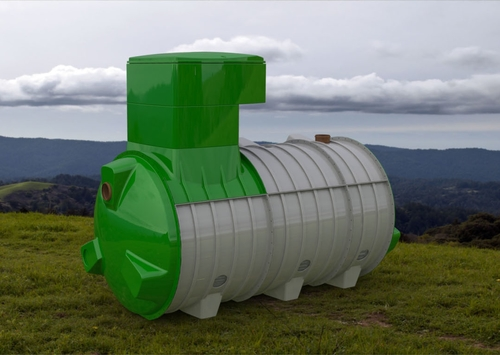</li>
                            <li class="slide">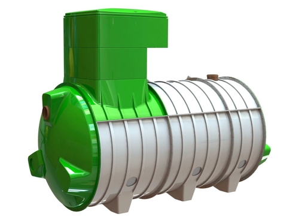</li>
                            <li class="slide">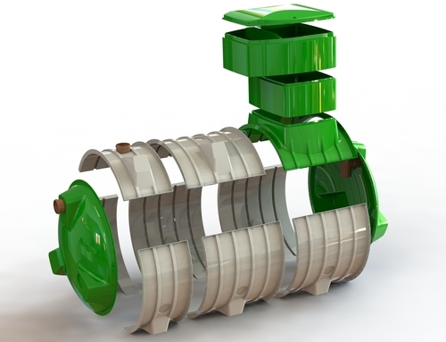</li>
                            <li class="slide">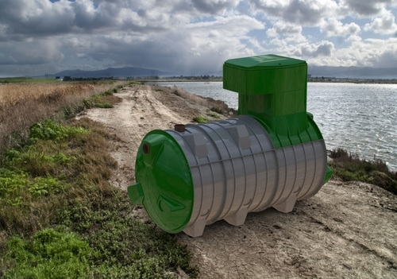</li>
                        </ul>

                        

                            

&#10094;

                            

&#10095;

                        

                        <ul id="nav-btns">
                            <li class="slide-nav-btn"></li>
                            <li class="slide-nav-btn"></li>
                            <li class="slide-nav-btn"></li>
                            <li class="slide-nav-btn"></li>
                        </ul>

                    

                

                
            

            
            

                
Это проверенная временем и многолетней эксплуатацией технология автономной канализации «Биолайн» (биосептик) в разборном корпусе и современном дизайне из стеклопластика и композитных материалов.

                
Система автономной канализации (биосептика) «BiNeo» - это собственная разработка компании «Екопласт Штанцл Украина», на основе 17-ти летнего опыта проектирования, производства, монтажа бытовых и промышленных систем водоочистки и водоподготовки.

                
Мы первыми внедрили данную технологию очистки сточных вод на рынке Украины 17 лет назад. На сегодняшний день технология,
                    применяемая в «BiNeo», это самое совершенное решение в области автономной канализации во всем
                    мире. По легкости, прочности, сроку службы, дизайну и простоте монтажа не имеет аналогов на рынке
                    Украины, и лишь немногочисленные аналоги на рынке Евросоюза и США.

            

            
        

   
    </section>

        

            <h1 class="why-bineo">Почему именно BiNeo</h1>

            

                
                  
                    

                        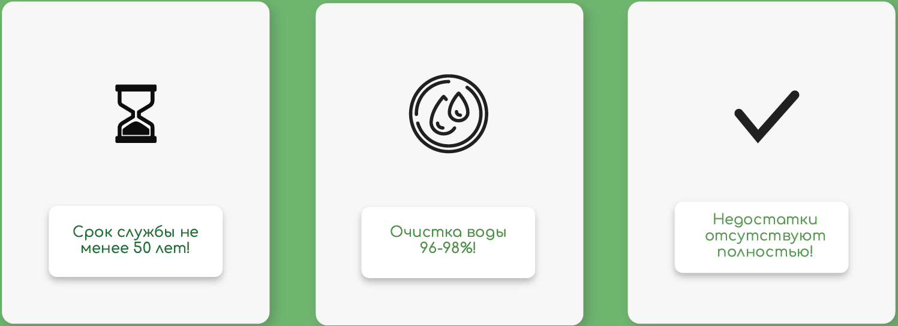
                    

                    

                        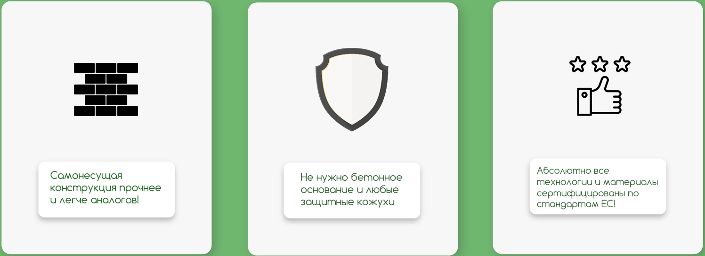
                    

                    

                        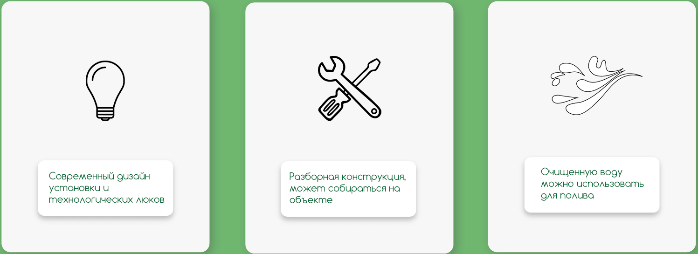
                    

                

            

        

        
        

И ЕЩЕ ОДНО ПРЕИМУЩЕСТВО!

        
        

            
Мы оставили цену на BiNeo такую-же, как и на установки «Биолайн» предыдущих поколений и их аналоги на рынке Украины

            

                

                    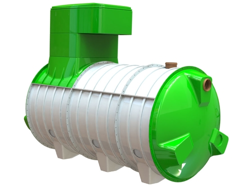
                

                

                    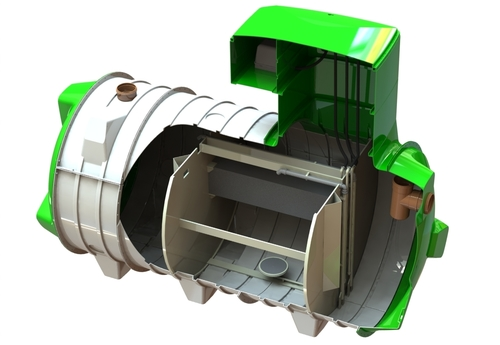
                

            

            

                

                    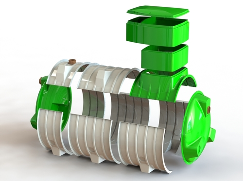
                

            
                

                    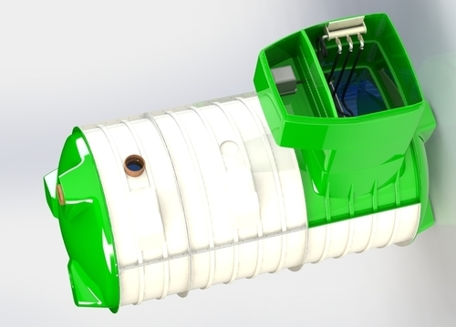
                

            

        

        

            
Монтаж и сборка

            

                
Шаг 1

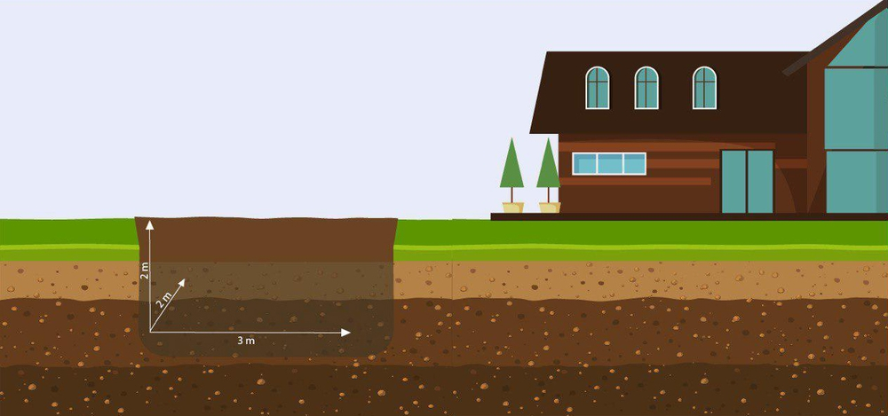

            

            

                
Шаг 2

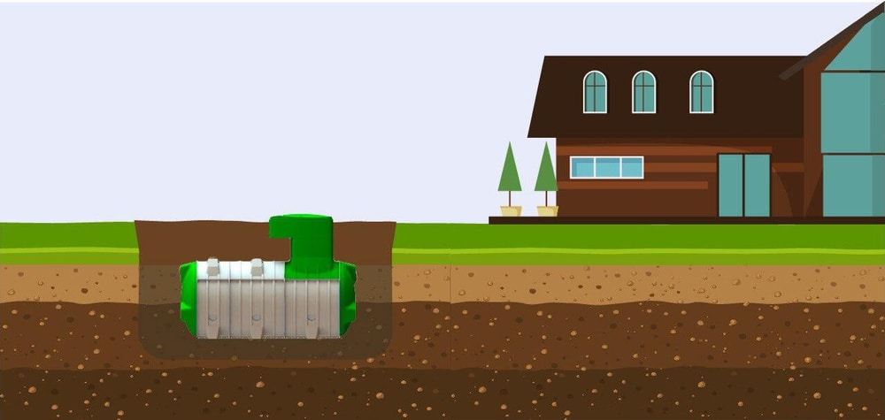

            

            

                
Шаг 3

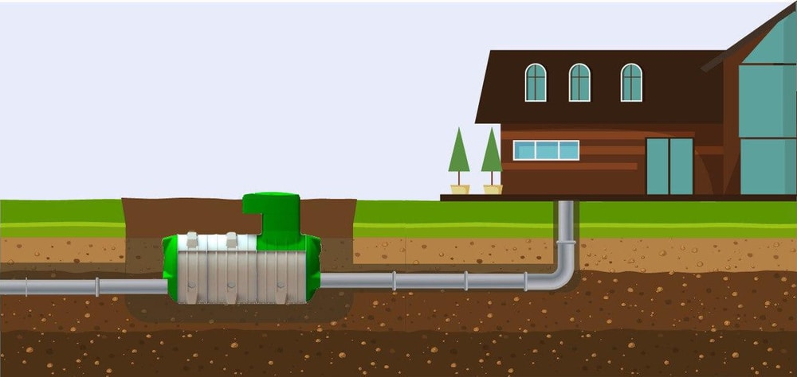

            

            

                
Шаг 4

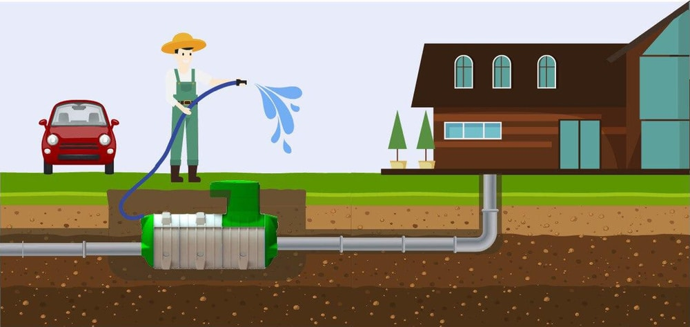

            

        

        

            
Модельный ряд и цены канализационных установок «BiNeo»

            <table class="bineo-table">
                <tbody>
                  <tr class="bineo-tbl-grn">
                      <td rowspan="2"><b>Тип</b></td>
                      <td>Количество пользователей</td>
                      <td class="second-none">Продуктивность</td>
                      <td class="first-none">Длина (А)</td>
                      <td class="first-none">Диаметр (В)</td>
                      <td><strong>Розничная цена без НДС</strong></td>
                  </tr>
                  <tr class="bineo-tbl-grn">
                    <td>Чол.</td>
                    <td class="second-none">м3/сутки</td>
                    <td class="first-none">мм</td>
                    <td class="first-none">мм</td>
                    <td>euro</td>
                  </tr>
                  <tr>
                    <td class="bineo-tbl-grn">"Bioline-NEO"-3</td>
                    <td>1-4</td>
                    <td class="second-none">0.6</td>
                    <td class="first-none">1650</td>
                    <td class="first-none">1600</td>
                    <td>1700</td>
                  </tr>
                  <tr>
                    <td class="bineo-tbl-grn">"Bioline-NEO"-5</td>
                    <td>1-5</td>
                    <td class="second-none">1-1.2</td>
                    <td class="first-none">2765</td>
                    <td class="first-none">1600</td>
                    <td>2700</td>
                  </tr>
                  <tr>
                    <td class="bineo-tbl-grn">"Bioline-NEO"-10</td>
                    <td>6-10</td>
                    <td class="second-none">1.5-1.7</td>
                    <td class="first-none">3400</td>
                    <td class="first-none">1600</td>
                    <td>3000</td>
                  </tr>
                  <tr>
                    <td class="bineo-tbl-grn">"Bioline-NEO"-15</td>
                    <td>11-15</td>
                    <td class="second-none">2.25-2.5</td>
                    <td class="first-none">3840</td>
                    <td class="first-none">1600</td>
                    <td>3400</td>
                  </tr>
                  <tr>
                    <td class="bineo-tbl-grn">"Bioline-NEO"-20</td>
                    <td>16-20</td>
                    <td class="second-none">3-3.3</td>
                    <td class="first-none">4475</td>
                    <td class="first-none">1600</td>
                    <td>4000</td>
                  </tr>
                  <tr>
                    <td class="bineo-tbl-grn">"Bioline-NEO"-25</td>
                    <td>21-25</td>
                    <td class="second-none">3.75-4</td>
                    <td class="first-none">4915</td>
                    <td class="first-none">1600</td>
                    <td>4700</td>
                  </tr>
                  <tr>
                    <td class="bineo-tbl-grn">"Bioline-NEO"-30</td>
                    <td>26-30</td>
                    <td class="second-none">4.5-5</td>
                    <td class="first-none">5990</td>
                    <td class="first-none">1600</td>
                    <td>5400</td>
                  </tr>
                  <tr>
                    <td class="bineo-tbl-grn">"Bioline-NEO"-40</td>
                    <td>31-40</td>
                    <td class="second-none">6-7</td>
                    <td class="first-none">8170</td>
                    <td class="first-none">1600</td>
                    <td>6500</td>
                  </tr>
                </tbody>
            </table>
        

        

            
Рассчитай стоимость своей автономной канализации:

            
            

                

                        

                            <table>
                            <tbody>
                            <tr><td id="calculator-label">
ВЫБЕРИТЕ ВАШУ СИСТЕМУ
</td>
                            </tr>
                            <tr>
                                <td id="chelovek"><select id="model-range">
						<option value="0">Bioline-NEO-3</option>
						<option value="1">Bioline-NEO-5</option>
						<option value="2">Bioline-NEO-10</option>
						<option value="3">Bioline-NEO-15</option>
						<option value="4">Bioline-NEO-20</option>
						<option value="5">Bioline-NEO-25</option>
						<option value="6">Bioline-NEO-30</option>
						<option value="7">Bioline-NEO-40</option>
					</select></td>
                            </tr>
                            <tr>
                                <td id="proizvoditelnost">Производительность (м3): 0.6</td>
                            </tr>
                            <tr>
                                <td id="field_name_stanok_value">Количество человек: до 4</td>
                            </tr>
                            <tr>
                                <td id="field_price_stanok_value">Стоимость: 1700 &#8364; (евро)</td>
                            </tr>
                            </tbody>
                            </table>
                        

                    

                

            

            
            

               
Для заказа или консультации обращайтесь в соотвествующий отдел
 
            

        

            

                
Дилерам и оптовикам

                
Тел: (050)453-50-95

                
E-mail: roman@ekoplast.com.ua

            

            
            

                
Розничным клиентам

                
Тел: 098-156-88-35

                
E-mail: ecoplaststancl@gmail.com

            

            
            

                
Партнеры

                
                

                    

                    
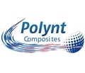

                    
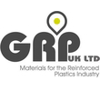

                

                
            

        

        

            

                
            

            
            

                
            

        

        
        
        
        
    </body>
</html>
